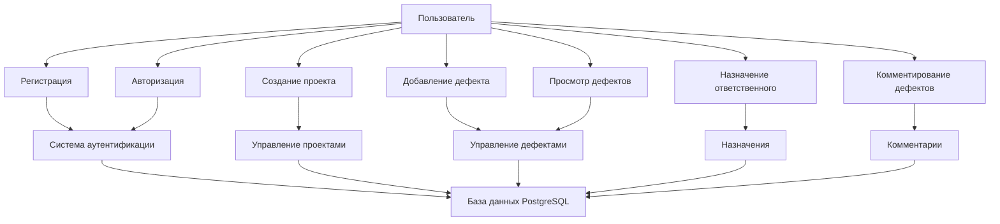
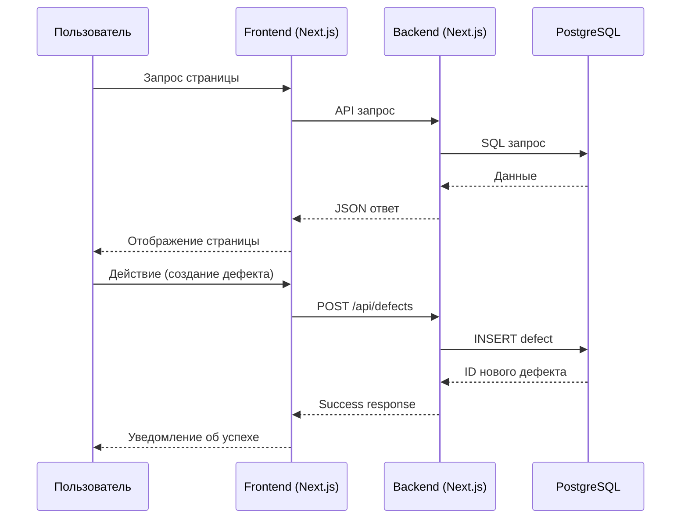
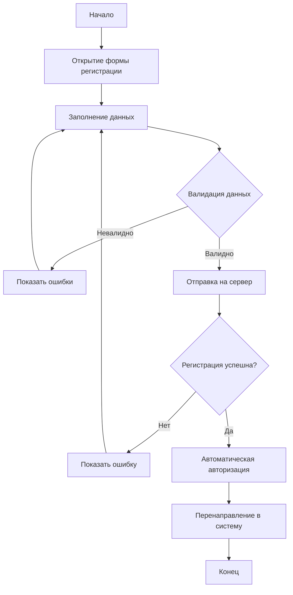
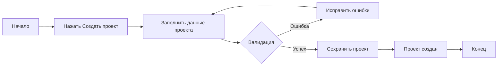
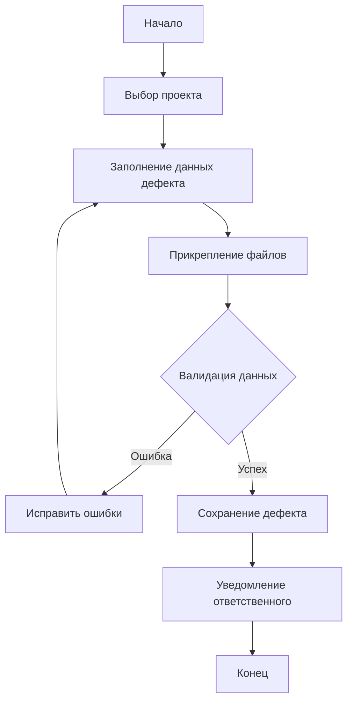
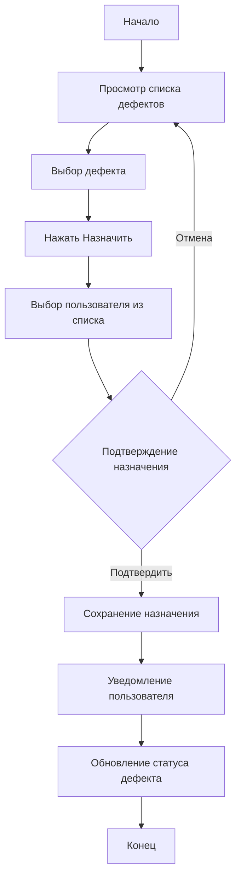
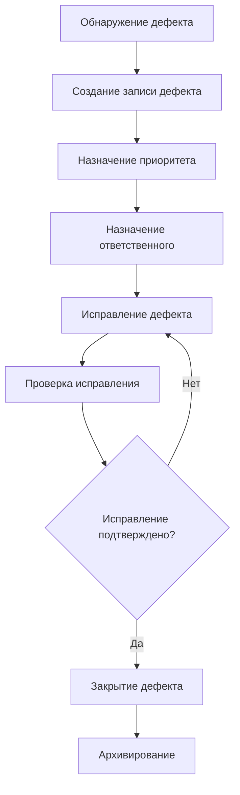

# Defect Management System

## Автор
**Новиков Даниил Дмитриевич**  
ЭФБО-03-23

## Описание проекта
Система управления дефектами с веб-интерфейсом для отслеживания и управления дефектами в проектах.

## Архитектура системы

### Технологический стек
- **Frontend**: Next.js - интерфейс управления дефектами
- **Backend**: Next.js + PostgreSQL - серверная логика и хранение данных
- **Контейнеризация**: Docker Compose
- **База данных**: PostgreSQL для структурированного хранения данных

### Компоненты системы
- Пользователи и аутентификация
- Управление проектами
- Трекинг дефектов
- Система комментариев
- Назначение ответственных

## Диаграммы системы

### Use Case Diagram

###Sequence Diagram

##Workflow процессы

###Workflow: Регистрация пользователя

###Workflow: Создание нового проекта

###Workflow: Добавление дефекта

###Workflow: Выбор ответственного за дефект

###Workflow: Новый дефект (полный цикл)

